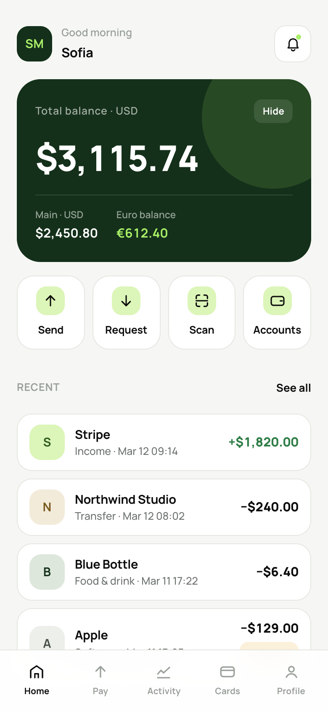
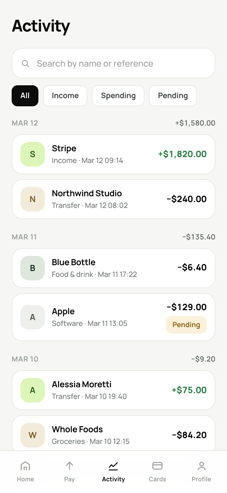
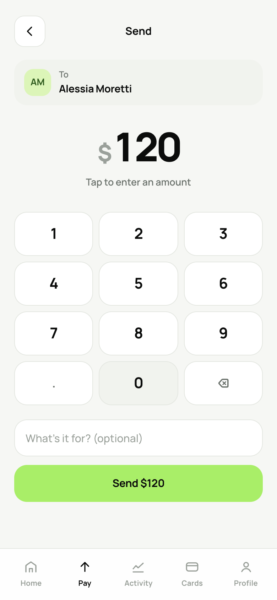
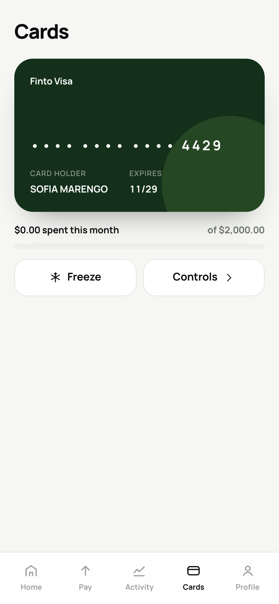
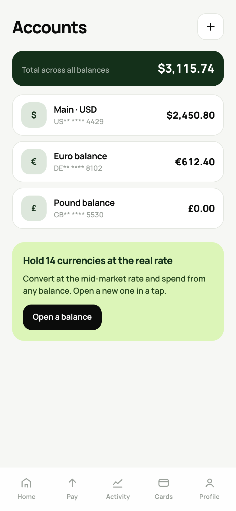
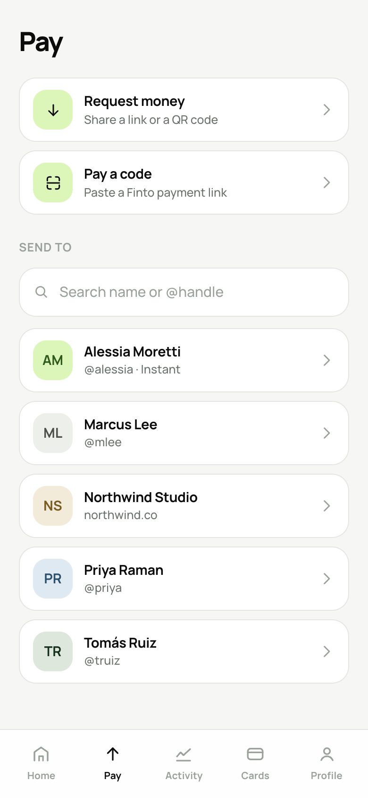
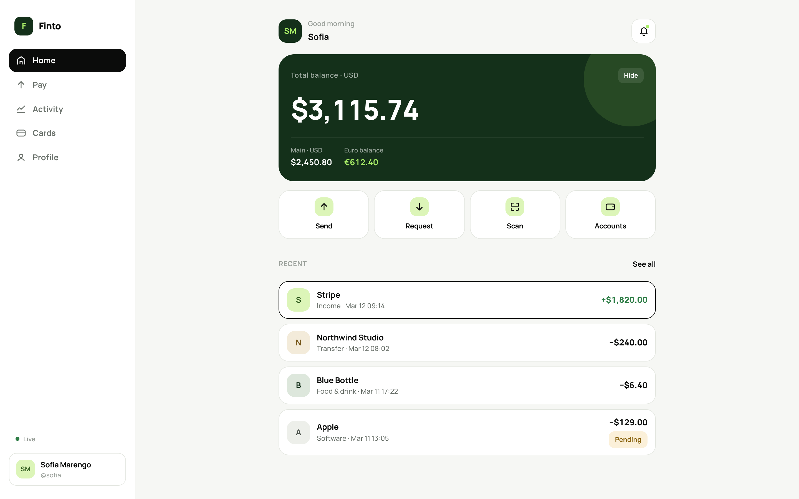
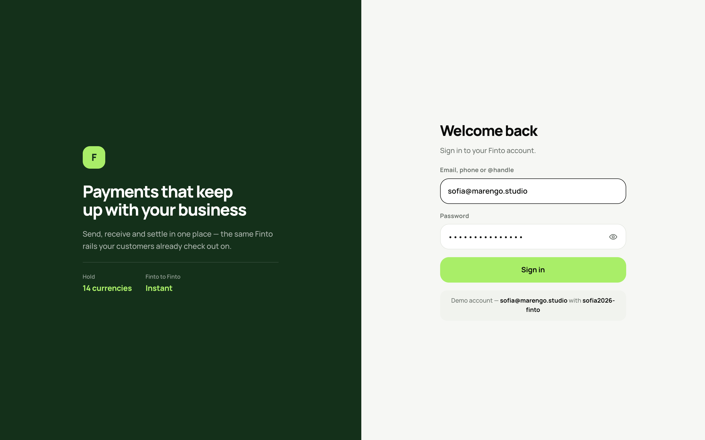

# Finto Payment App

**[Try it live](https://finto-payment-app-in-claude-code.vercel.app)** — sign in as
`sofia@marengo.studio` / `sofia2026-finto`. This is the real app talking to a real
API ([`finto-backend`](finto-backend), serverless on Vercel) and a real Postgres
database (Supabase) — not a mock or a static demo.

> Hosted on free tiers, so the first request after a quiet period can take a
> few seconds while the database connection wakes up.

A fictional multi-currency banking app built from an original UI concept and developed into a working full-stack product with Claude Code.

Finto lets users manage balances across multiple currencies, send and request money, pay through QR codes, track transactions, and manage card settings across web and mobile.

The project includes a TypeScript backend, React web app, and React Native mobile app — all connected through a shared API and shared types.

|              |                                                                                       |
| ------------ | ------------------------------------------------------------------------------------- |
| **Design**   | Original UI/UX design · 15 screens                                                    |
| **Backend**  | TypeScript · Fastify · PostgreSQL · Drizzle ORM                                       |
| **Web**      | React 19 · Vite · React Router                                                        |
| **Mobile**   | React Native · Expo SDK 54 · Expo Router                                              |
| **Database** | Supabase · PostgreSQL 17                                                              |
| **Testing**  | 53 tests covering money handling, ledger integrity, authentication, and API behaviour |

---

## A look at it

<p align="center">
  
  
  
</p>

<p align="center">
  
  
  
</p>

The same screens on a desktop browser — one codebase, with the tab bar becoming
a side rail:

<p align="center">
  
</p>

<p align="center">
  
</p>

---

## What it does

* Hold balances across **14 currencies**
* Send money to contacts or `@handles`
* Request money with a shareable QR code
* Scan QR codes to make payments
* Browse, search, and filter transaction activity
* Freeze and manage cards
* Set monthly spending limits
* Control online and international payments
* Receive real-time notifications
* Keep web and mobile activity in sync through one API

Finto-to-Finto payments settle instantly, with changes reflected across connected devices in real time.

---

## A few things I built under the hood

### Precise money handling

Money is never stored as a JavaScript floating-point number.

Amounts are stored as integer minor units alongside their ISO currency code, and API amounts are passed as decimal strings to avoid precision loss.

```ts
parseAmount("240.50", "USD") // 24050n
formatMoney(24050n, "USD")   // "$240.50"
```

This means calculations remain predictable even when transactions are processed repeatedly.

### Double-entry ledger

Every money movement is recorded through a double-entry ledger rather than relying on a balance field alone.

Each transaction creates balanced entries that must net to zero within a currency. Balance updates happen inside the same database transaction, so a payment cannot partially complete.

The system also handles concurrent payments safely and prevents balances from being spent twice.

### Safe payment retries

Payment requests support idempotency keys, so retrying a request after a network failure does not accidentally create a second payment.

If the same request is sent again, the original result is returned instead of processing the payment twice.

---

## How it fits together

```text
                    ┌──────────────┐
                    │   Supabase   │
                    │ PostgreSQL 17│
                    └──────▲───────┘
                           │
                    ┌──────┴───────┐
                    │     API      │
                    │ Fastify + WS │
                    └──▲────────▲──┘
                       │        │
                 REST + WS  REST + WS
                       │        │
              ┌────────┘        └────────┐
              ▼                          ▼
       ┌─────────────┐            ┌─────────────┐
       │   Web App   │            │ Mobile App  │
       │   React     │            │React Native │
       └─────────────┘            └─────────────┘
                 \                  /
                  \                /
                   └── Shared API ─┘
                      + shared types
```

Both front ends use the same API and shared type definitions, keeping the web and mobile experiences consistent.

---

## Security

The project also explores production-style security patterns, including:

* Password hashing with Node's built-in `scrypt`
* Rotating refresh tokens
* Platform-specific token storage
* `httpOnly` cookies for web authentication
* Device keychain storage for mobile
* Reduced-scope tokens for PIN unlock
* Idempotency protection for money-moving requests
* Rate limiting on sensitive endpoints
* Card numbers kept outside the application database

---

## Running it

Requires Node 20+ and PostgreSQL, or a Supabase connection.

```bash
# API
cd finto-backend
npm install
cp .env.example .env
npm run db:migrate
npm run db:seed
npm run dev

# Web
cd finto-web
npm install
npm run dev

# Mobile
cd finto-mobile
npm install
npx expo start
```

See [`START-HERE.md`](./START-HERE.md) for setup instructions and troubleshooting.

---

## What's intentionally not finished

Finto is a working product prototype, not a real banking service. Some production integrations are deliberately left as extension points:

* External payment rails are not connected
* Card issuing uses a stand-in processor integration
* APNs/FCM push notifications are not implemented
* Exchange rates currently come from a local data table
* KYC, sanctions screening, transaction monitoring, licensing, and banking partnerships are outside the scope of the project

The goal was to build the **product experience and financial infrastructure underneath it**, while being transparent about what would still be required for a real-world financial service.

---

## Project structure

```text
finto-backend/
  src/ledger/          double-entry posting engine
  src/modules/         auth, payments, cards, etc.
  packages/api-client/ shared API client and types
finto-web/             React web application
finto-mobile/          React Native iOS + Android application
```

### Built with Claude Code

Finto started as a clickable UI prototype and was developed into a working full-stack application through vibe coding with Claude Code.
